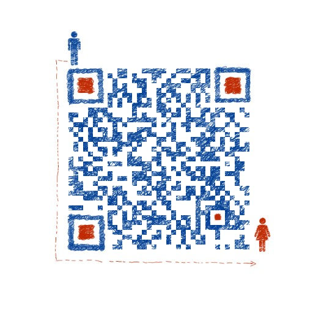

<h1 align="center">灵芝 🎉🎉🎉</h1>

> 一款交互式应用安全评估工具（被动式）

## 简介
1.灵芝IAST属于被动式IAST，不需要重放数据包，不产生脏数据；

2.被动式IAST具有近实时检测、高检出率、低误报率、低漏报率等特点；理论上可以实现0误报，但是，在复杂场景下，会出现污点链路不准确、误报等情况，尤其是使用了自定义的过滤函数

## 灵芝极速体验
- 第一步：获取IAST-TOKEN
- 第二步：部署AGENT并启动WEB应用

#### 获取IAST-TOKEN
##### 1.注册成为火线白帽
访问[火线官网](https://www.huoxian.club/#/index)进行注册

##### 2.访问火器获取
登录火线后，访问“火器-灵芝IAST”，点击“下载安装灵芝”即可看到“IAST Token”

#### 部署AGENT
关于部署，可以访问[【火器】“灵芝IAST”交互式应用安全测试工具使用姿势](https://mp.weixin.qq.com/s/VRZE5eRfjGK66yyTK4UkbA) 进行查看

## 问答区
1.火线平台地址是什么？

https://www.huoxian.club/#/index

2.灵芝IAST只支持Linux吗？

Windows也支持的哦，Windows下的使用教程正在赶来的路上，表哥们喝杯咖啡先～

3.灵芝支持Dubbo、微服务吗？

IAST与框架本身无关，理论上只要在节点上都安装agent就可以支持，但是，只有经过充分的测试才可以对外公布，所以，暂时不支持，分布式框架测试的已在排期中，表哥等等弟弟

如果表哥有不确定的地方，一定要前往讨论区联系火表弟，火表弟会及时的给表哥解答疑惑。

## 重要、重要、重要：
表哥们针对IAST技术有其它他好的想法可以交流哦，表弟帮你实现它

## 讨论区
1.Github issue: https://github.com/huoxianclub/LingZhi/issues

2.微信群：扫描以下二维码加火表弟的个人微信，火表弟会把大家拉进技术交流群

