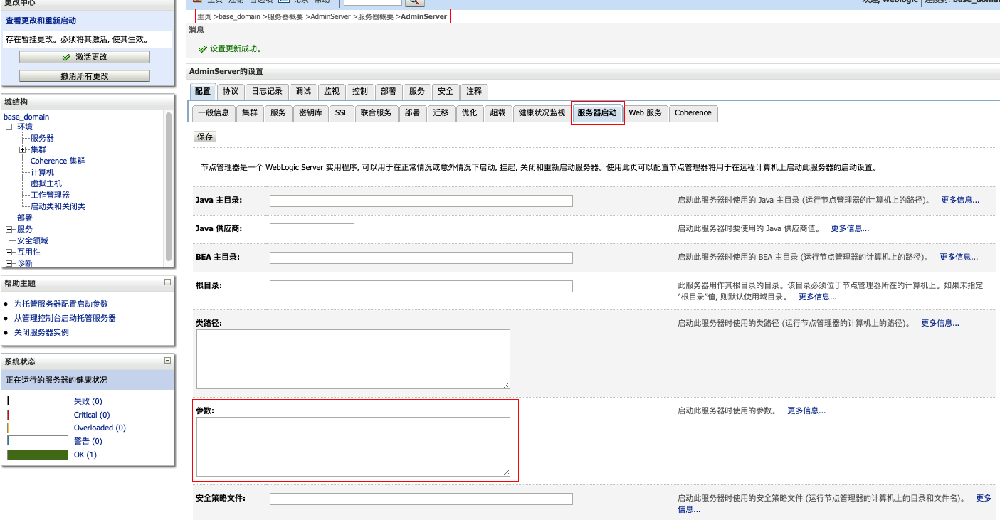
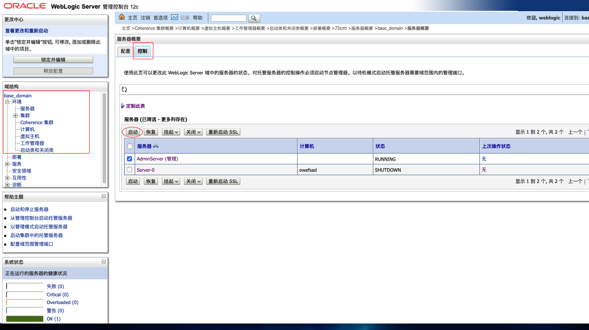

#### 手动修改
> 非集群模式

##### 1.安装Agent.jar

从git的release处下载agent.jar文件，然后在WebLogic的安装目录中创建文件夹iast，如`/u01/oracle/weblogic/user_projects/iast`，复制下载的agent.jar文件到创建的iast目录中

agent.jar在启动的过程中需要在iast目录中释放配置文件，所以需要在Linux下修改iast目录的权限，e.g: `chmod 777 -R /u01/oracle/weblogic/user_projects/iast`

##### 2.部署Agent

进入`WebLogic`目录，打开`bin/startWebLogic.sh`文件，找到`JAVA_OPTIONS="${SAVE_JAVA_OPTIONS}"`所在行，在该行的下面增加一行`JAVA_OPTIONS="-javaagent:/u01/oracle/weblogic/user_projects/iast/agent.jar=token=<iast-token>"`

> 集群模式

#### 方式一、通过WebLogic的console控制台

访问weblogic的console，例如：

1.找到“环境”下的“服务器”，然后在服务器列表中点击需要安装agent的服务器，如：AdminServer

2.进入服务器详情，点击“服务器启动”，在下方的参数一栏中填入javaagent的参数`-javaagent:/u01/oracle/weblogic/user_projects/iast/agent.jar=token=<iast-token>`，如

3.重启服务器，使配置生效

#### 方式二、通过修改weblogic的config.xml文件

##### 1.安装Agent.jar

从git的release处下载agent.jar文件，然后在Jetty的安装目录中创建文件夹iast，如`/u01/oracle/weblogic/user_projects/iast`，复制下载的agent.jar文件到创建的iast目录中

agent.jar在启动的过程中需要在iast目录中释放配置文件，所以需要在Linux下修改iast目录的权限，e.g: `chmod 777 -R /u01/oracle/weblogic/user_projects/iast`

##### 部署Agent
找到`/u01/oracle/weblogic/user_projects/domains/base_domain/config`目录下的`config.xml`文件，定位到`<server-start>`标签下的`<arguments>`标签，在标签内添加如下配置：
`-javaagent:/u01/oracle/weblogic/user_projects/iast/agent.jar=token=<iast-token>`