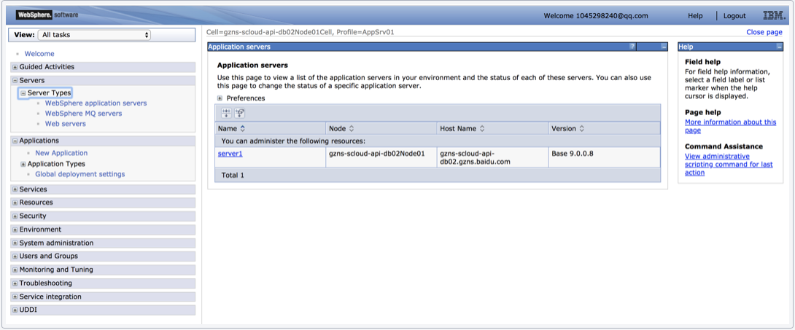
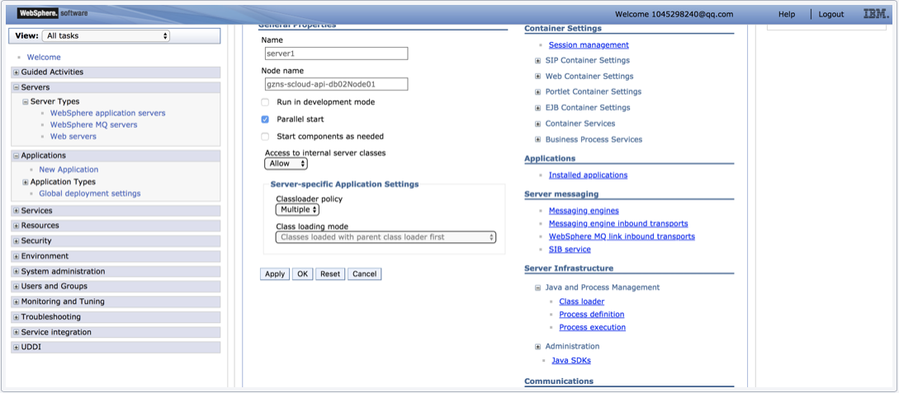
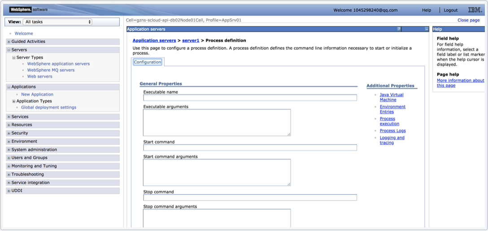

#### 手动安装

##### 1.安装Agent.jar

在WebSphere的安装目录创建文件夹iast，复制下载的agent.jar文件到创建的iast目录中

agent.jar在启动的过程中需要在iast目录中释放动态库和配置文件，所以需要在Linux下修改iast目录的权限，e.g: `chmod 777 -R /opt/IBM/WebSphere/AppServer/iast`

#### 2.配置WebSphere服务器
进入WebSphere WEB端的管理后台，在控制台左侧的导航栏里，选择`Servers -> Server Types -> WebSphere Application Server`，进入应用列表界面：

选择需要安装agent的应用（以server1为例），点击进入管理页面。在新页面向下翻，找到`Server Infrastructure -> Process definition`，并点击进入：

点击`Additional Properties -> Java Virtual Machine`进入JVM启动参数编辑界面

找到`Generic JVM arguments`选项，开始编辑并在里面填写以下内容并保存`-javaagent:/opt/IBM/WebSphere/AppServer/iast/agent.jar=token=<iast-token>`

重启对应修改后的server应用

